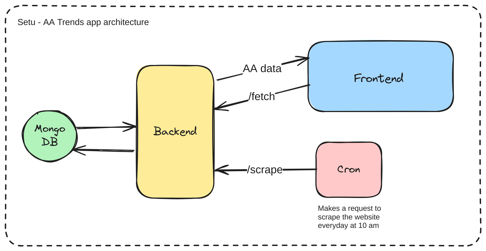

# Setu AA trends app

A trends app to show trends of each AAs daywise

## Architecture




## About

The stack consists of 3 services: Frontend, backend and cron. The cron makes sure that the website is scraped everyday @ `10 AM` by calling the `/scrape` route. The frontend uses the `/fetch` route of backend to fetch data.The scraped data is store in MongoDB

## Points to Note

+ In MongoDB, we store the data in a collection named `aa_data` insde `setu` named db.

+ If no data is present in the db, then we use mock AA names to render the charts and a 3 days of mock data is added to each chart.

+ 3 days of Mock data is added to each AA's chart if we have got less than 3 days of data.


## Stack

+ Frontend: Next.js, React.js, Chart.js(for displaying charts) 
+ Backend: Flask, MongoDB
+ Cron: Docker image

## Explaining the charts


+ The Y-Axis represents the count of each status(Live, NA or Testing)
+ The X-Axis represents the day.
+ The 3 different lines represents Live, N/A and Testing.


## Backend APIs

+ `<host>:<port>/scrape`[POST]: Scrapes the Sahamati AA website.

+ `<host>:<port>/fetch`[GET]: Retrieves the scraped AA data


## Interacting with the app


### Clone the Repo and change directory

```bash
git clone https://github.com/suvnshr/setu-aa-trends.git

cd setu-aa-trends
```


### Run the app

```bash
./scripts/run.sh
```

### Stop the app

```bash
./scripts/down.sh
```

### Reset the app(remove db data)

```bash
./scripts/reset.sh
```

## Testing the app

### Test all services

```bash
./run_tests/test_app.sh
```

### Test backend service

```bash
./run_tests/test_backend.sh
```
### Test frontend service

```bash
./run_tests/test_frontend.sh
```